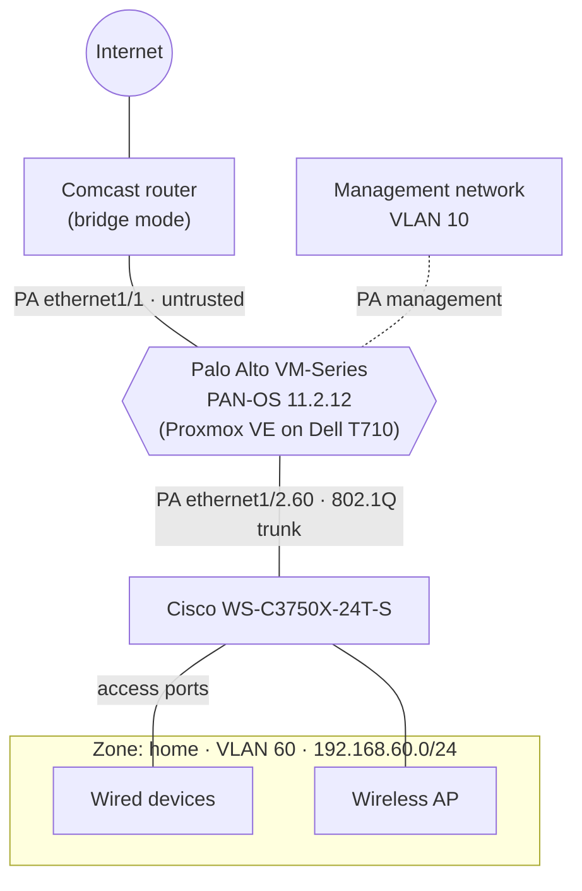

# Palo Alto Firewall VM Edge Project - IN PROGRESS

## Overview

In this project, I put my entire home network behind a Palo Alto firewall VM. The purpose is to add the pressure of impacting more than just myself: if I break something in the config, it's not just me who is affected, but my family, which is pressure you can't replicate in a typical lab environment. The goal is to take on the responsibility of managing my home network's firewall, practicing working under pressure and with urgency to solve problems that now affect real users.

## Technology Utilized

- Palo Alto Firewall VM (11.2.12)
- Cisco WS-C3750X-24T-S (15.2(4)E10)
- Proxmox VE (9.2.5)

## Architecture

### Interface mapping

| PA interface | Zone | Proxmox vNIC | Proxmox bridge | Connects to |
|--------------|------|--------------|----------------|-------------|
| management | — | net0 | vmbr10 | Management network (VLAN 10) |
| ethernet1/1 | untrusted | net1 | vmbrWAN | Comcast router (bridge mode) |
| ethernet1/2 | — (trunk parent) | net2 | vmbr0 | Cisco 3750X trunk port |
| ethernet1/2.60 | home | net2 | vmbr0 | VLAN 60 (tagged) |

## Index

### Build docs

| # | Doc | Summary | Status |
|---|-----|---------|--------|
| 01 | [Baseline setup](docs/01-baseline-setup.md) | Cisco VLANs, Comcast bridge mode, Proxmox networking, PA interfaces/zones, DHCP, security and NAT policies | :white_check_mark: Complete |
| 02 | [Security profile group](docs/02-security-profile-group.md) | Security profiles bundled into a group and applied to policies | :memo: Planned |
| 03 | [SSL decryption](docs/03-ssl-decryption.md) | Decrypting home-zone traffic to improve App-ID accuracy | :memo: Planned |

### Incidents

| Incident | Root cause |
|----------|------------|
| [Discord voice calls stuck on 'Disconnected'](incidents/discord-voice-calls-stuck-on-disconnected.md) | Discord's SSL dependency on non-standard ports missed the `application-default` service and fell through to `interzone-default` |
